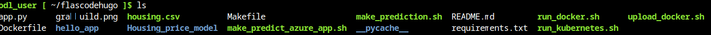

# Overview

In this project, I built a Github repository from scratch and created a scaffolding that assisted me in performing both Continuous Integration and Continuous Delivery. I used Github Actions along with a Makefile, requirements.txt and application code to perform an initial lint, test, and install cycle. Next, I integrated this project with Azure Pipelines to enable Continuous Delivery to Azure App Service.

## Project Plan

* A link to a [Trello](https://trello.com/b/nQ1YXymx/project-management) board for the project
* A link to a [spreadsheet](https://docs.google.com/spreadsheets/d/1FH4DlHbekuHPKbjYGb84ZCZzjj-oKbDDoqqklHm8JzY/edit#gid=1348135932) that includes the original and final project plan>

## Instructions


* Architectural Diagram (Shows how key parts of the system work)>


Instructions for running the Python project.  How could a user with no context run this project without asking you for any help.  Include screenshots with explicit steps to create that work. Be sure to at least include the following screenshots:

1. Login in your Azure account
2. From the Azure Console, open the Cloud Shell (Bash) terminal
3. Generate and set up SSH Keys in your azure cloud shell, add them (id_rsa.pub) to your GitHub repository and then clone the project there.
  ssh-keygen -t rsa
  cat ~/.ssh/id_rsa.pub
  git clone <repository>
   


* Project running on Azure App Service

* Project cloned into Azure Cloud Shell

* Passing tests that are displayed after running the `make all` command from the `Makefile`
!(make)[makeallshot.png)
* Output of a test run

* Successful deploy of the project in Azure Pipelines.  [Note the official documentation should be referred to and double checked as you setup CI/CD](https://docs.microsoft.com/en-us/azure/devops/pipelines/ecosystems/python-webapp?view=azure-devops).

* Running Azure App Service from Azure Pipelines automatic deployment

* Successful prediction from deployed flask app in Azure Cloud Shell.  [Use this file as a template for the deployed prediction](https://github.com/udacity/nd082-Azure-Cloud-DevOps-Starter-Code/blob/master/C2-AgileDevelopmentwithAzure/project/starter_files/flask-sklearn/make_predict_azure_app.sh).
The output should look similar to this:

```bash
udacity@Azure:~$ ./make_predict_azure_app.sh
Port: 443
{"prediction":[20.35373177134412]}
```

* Output of streamed log files from deployed application

> 

## Enhancements

<TODO: A short description of how to improve the project in the future>

## Demo 

A link to a [Screencast](https://www.youtube.com/watch?v=E4mO23dOGpE) on YouTube!


